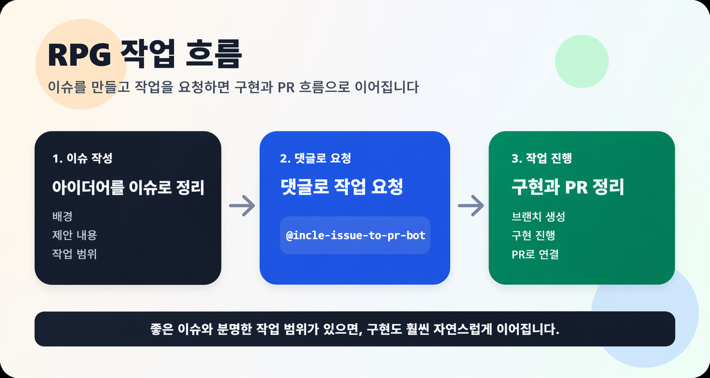

# 🎮 RPG

<div align="center">

## 이슈 하나로, RPG 세계를 함께 만든다




👉 게임 페이지: https://inclerepo.github.io/-RPG/

이 프로젝트는 **아이디어 단계부터 모두가 함께 만드는 웹 RPG**입니다.

👉 지금은 **게임 기획 / 아이디어 단계**입니다
👉 누구나 이슈 하나로 세계 설계에 참여할 수 있습니다

</div>

---

## ✨ What is this?

이 프로젝트는 코드를 먼저 만드는 프로젝트가 아닙니다.

👉 **아이디어 → 이슈 → 구현 → PR**

이 흐름으로
**게임 세계 자체를 함께 설계하는 협업형 RPG 프로젝트**입니다.

- 기능이 아니라 “게임 세계”를 만든다
- 코드가 아니라 “아이디어”부터 시작한다
- 누구나 참여 가능하다

---

## 🔥 Why Join Now?

지금이 가장 재밌는 단계입니다.

- 🎯 게임 방향을 직접 결정할 수 있음
- 🧠 시스템 설계에 참여 가능
- 🧩 핵심 구조를 만드는 초기 멤버가 됨

👉 **이미 만들어진 게임에 기여하는 게 아니라
게임 자체를 같이 만드는 단계**

---

## 🧭 Workflow

1. **아이디어를 이슈로 작성**
2. **봇 호출 (@incle-issue-to-pr-bot)**
3. **구현 + PR 생성**

---

## 🧠 지금 필요한 아이디어

🔥 지금 참여 가능한 영역

- [ ] 전투 시스템 구조
- [ ] 캐릭터 성장 방식
- [ ] NPC 및 대화 시스템
- [ ] 퀘스트 구조
- [ ] 맵 탐험 방식
- [ ] UI / HUD 컨셉
- [ ] 모바일 조작 방식
- [ ] 게임 세계관 설정

👉 **아무거나 하나만 던져도 된다**

---

## 🧩 How to Contribute

### 1. 이슈 작성

```md
## 배경

왜 필요한지

## 제안 내용

어떤 시스템인지

## 기대 결과

어떻게 동작해야 하는지
```

---

### 2. 봇 호출

```text
@incle-issue-to-pr-bot 이거 만들어줘
```

---

### 3. 결과 확인

- 코드 생성
- 브랜치 생성
- PR 생성

---

## 📌 Good Issue Example

👉 나쁜 예 ❌
“전투 시스템 만들어주세요”

👉 좋은 예 ✅
“턴제 전투 + 스킬 쿨타임 기반 구조로 설계하면 좋을 것 같음
모바일에서도 플레이 가능해야 함”

---

## 🧱 Current Progress

🟡 기획 단계

- [x] 프로젝트 구조 정의
- [x] 워크플로우 구축
- [x] 주인공 도트 모션 초안 제작
- [ ] 게임 시스템 설계
- [ ] 핵심 기능 구현
- [ ] 플레이 가능 상태

---

## 🎨 Sprite Assets

주인공 기본 스프라이트 세트가 `assets/sprites/player/`에 추가되었습니다.

- 컨셉: `미라진 출신 여명 인양사`
- 구성: `idle`, `walk`, `run`, `jump`, `fall`, `attack`, `hurt`, `death`
- 포맷: 투명 배경 `48x48 PNG`

프레임 단위 파일과 함께 간단한 프리뷰 시트도 포함되어 있어
이동, 점프, 전투 시스템을 붙이기 전에 바로 참고할 수 있습니다.

---

## 🛠 Tech Stack

- HTML / CSS / JavaScript
- Vite
- GitHub Issues
- LLM 기반 자동화

---

## ⭐️ Join Us

이 프로젝트가 재밌어 보인다면

👉 ⭐️ 눌러주고
👉 이슈 하나만 남겨주세요

<br/>
