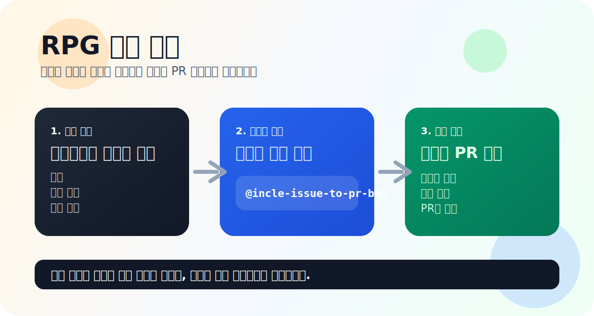

# <div align="center">RPG</div>

<div align="center">이슈를 바탕으로 천천히 다시 만들어가는 웹 RPG 프로젝트</div>

<br />

<div align="center">
  <a href="https://inclerepo.github.io/-RPG/">Live Page</a>
  ·
  <a href="https://github.com/IncleRepo/-RPG/issues">Issues</a>
  ·
  <a href="https://github.com/IncleRepo/-RPG/pulls">Pull Requests</a>
</div>

<br />



## 프로젝트 소개

이 저장소는 웹에서 실행되는 RPG를 다시 만들어 보기 위한 오픈 프로젝트입니다.

지금은 큰 구조를 다시 잡는 단계이고, 구현은 GitHub Issue를 중심으로 이어가고 있습니다.

작업 흐름은 아래처럼 운영합니다.

- 누군가가 GitHub Issue로 아이디어, 버그, 기능 제안을 올립니다.
- 이슈 댓글에 봇을 멘션하면 작업이 이어집니다.
- 작업 결과는 브랜치, 커밋, PR 흐름으로 정리됩니다.

코드를 직접 열어서 기여해도 좋고, 이슈로 방향을 제안하는 방식으로 참여해도 괜찮습니다.

## 지금 보고 있는 것

- Live: https://inclerepo.github.io/-RPG/
- 현재 메인 페이지는 재개편을 위해 비워둔 상태입니다.
- 앞으로 이 저장소에서 RPG를 처음부터 다시 정리해 나갈 예정입니다.

## 기여 방법

좋은 아이디어가 있으면 이슈 하나로 시작하면 됩니다.

### 1. 이슈를 만든다

이슈에 아래처럼 적어주면 좋습니다.

- `배경`: 왜 필요한지
- `제안 내용`: 어떤 기능이나 변화인지
- `작업 범위`: 어디까지 만들면 되는지

예시:

```md
## 배경

전투 화면이 생기기 전에 기본 HUD 구조가 먼저 필요함

## 제안 내용

상단 상태바, HP/MP, 간단한 액션 버튼 UI를 먼저 만든다

## 작업 범위

- HUD 레이아웃 추가
- 모바일에서도 보이게 반응형 처리
- 스타일 분리
```

### 2. 이슈에서 봇을 멘션한다

이슈 댓글에 아래처럼 남기면 됩니다.

```text
@incle-issue-to-pr-bot 이 기능 구현해줘
```

짧게 적어도 되고, 원하는 방향을 더 구체적으로 붙여도 됩니다.

예시:

```text
@incle-issue-to-pr-bot 전투 UI 초안 만들어줘
```

```text
@incle-issue-to-pr-bot 모바일에서도 누르기 쉽게 버튼 크기 크게 잡아서 구현해줘
```

### 3. LLM이 작업을 진행한다

멘션 이후에는 이슈 내용을 바탕으로 작업이 진행됩니다.

- 관련 파일을 살핍니다
- 필요한 변경을 구현합니다
- 브랜치와 커밋을 만들고
- PR 흐름으로 결과를 남깁니다

이 저장소는 "작업 아이디어를 잘 정리해서 넘기면 구현이 이어지는 방식"에 가깝습니다.

## 어떤 이슈가 좋은가

아래 같은 이슈가 특히 잘 작동합니다.

- 플레이어 이동
- 전투 UI
- 대사 시스템
- 퀘스트 구조
- 사운드 연출
- 맵 탐색
- 저장 시스템
- 모바일 조작
- 아트 방향 제안
- 문서 개선

좋은 이슈의 공통점은 하나입니다.  
**무엇을 왜 만들고 싶은지가 읽는 순간 바로 이해되는 것**입니다.

## 프로젝트 방향

목표는 단순한 데모 페이지가 아니라, 기능을 하나씩 쌓아가며 완성도를 높여 가는 웹 RPG입니다.

예상 범위:

- 탐험
- 전투
- NPC와 대화
- UI/HUD
- 사운드
- 퀘스트
- 저장과 상태 관리
- 웹에서 바로 실행 가능한 플레이 경험

## 로컬 실행

```bash
npm install
npm run start
```

## 스크립트

```bash
npm run start
npm run build
npm run lint
npm run lint:fix
npm run format
npm run format:check
```

## 기술 스택

- HTML
- CSS
- JavaScript
- Vite
- GitHub Issues
- LLM 기반 작업 흐름

## 한 줄 요약

**이슈로 제안하고, 멘션으로 작업을 이어가며, 함께 RPG를 만들어가는 저장소입니다.**
